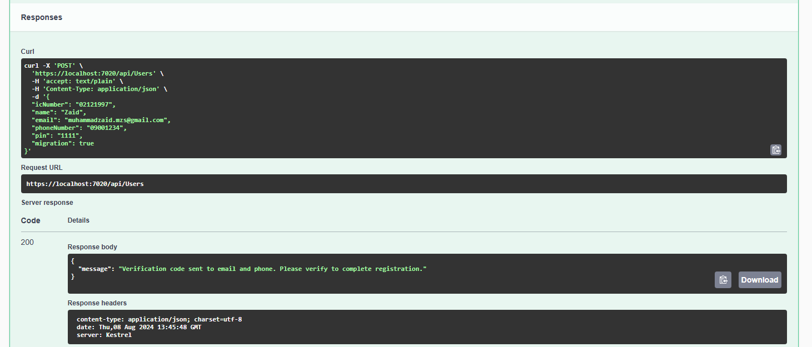
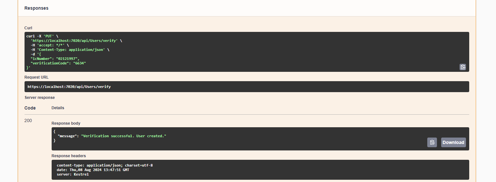
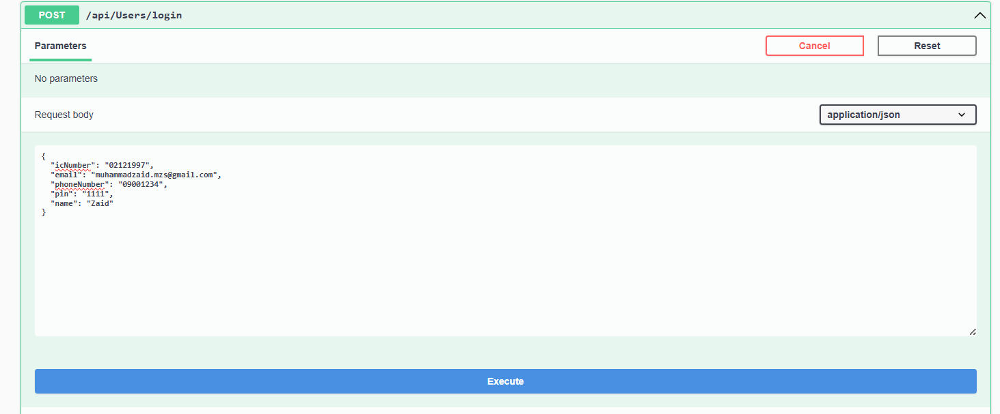
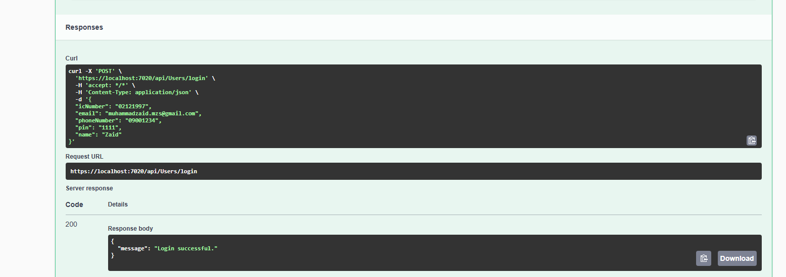

# Registration API's

## Checking IC Number 

You can see the user is not migrated

Using this API we will be checking the IC number if it is migrated or not if it is not migrated then migration will be updated and the user will be migrated. After the migration the code will be send to the email and number which will be tested using the verify API. After that the password api will be used to update the password against the user.

## Verification Code 

Verification code recieve on Email and SMS.

## Creation Of User

If the user is not present in the database it will be checked if it is not present then the register using the Post User API.

Then the user will be created after the verification using the same verification API which will be send to the email and number which will be tested using the verify API. After that the password api will be used to update the password against the user.

## Verification Code 

Verification code recieve on Email and SMS.

## Login 

We will check if the user is present against the same IC number , Name , phone number and Email Address then the user will be redirected to the login page and it will login using the login API.

