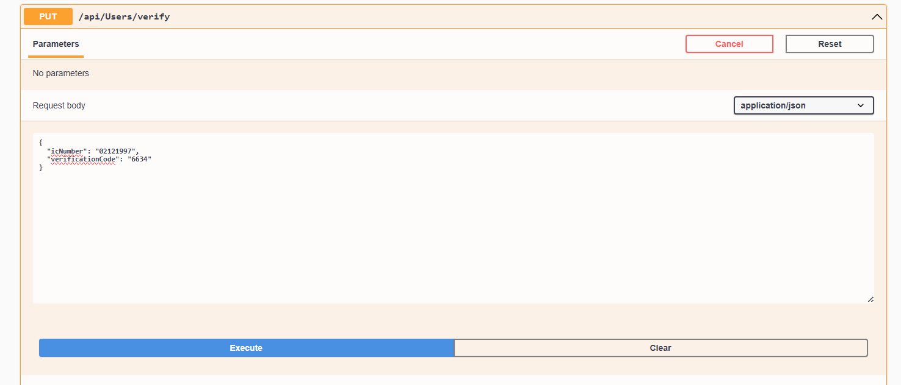
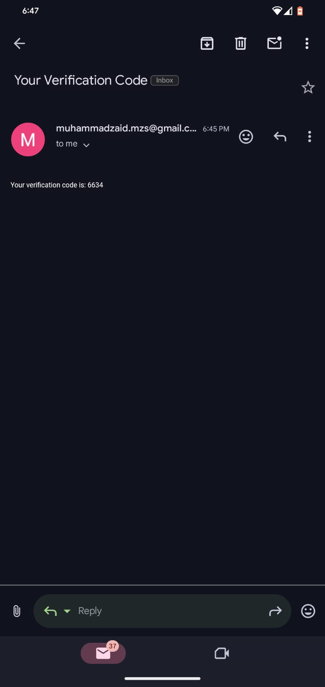

# Registration API's

## Checking IC Number 

You can see the user is not migrated

Using this API we will be checking the IC number if it is migrated or not if it is not migrated then migration will be updated and the user will be migrated. After the migration the code will be send to the email and number which will be tested using the verify API. After that the password api will be used to update the password against the user.

## Verification Code 

Verification code recieve on Email and SMS.

