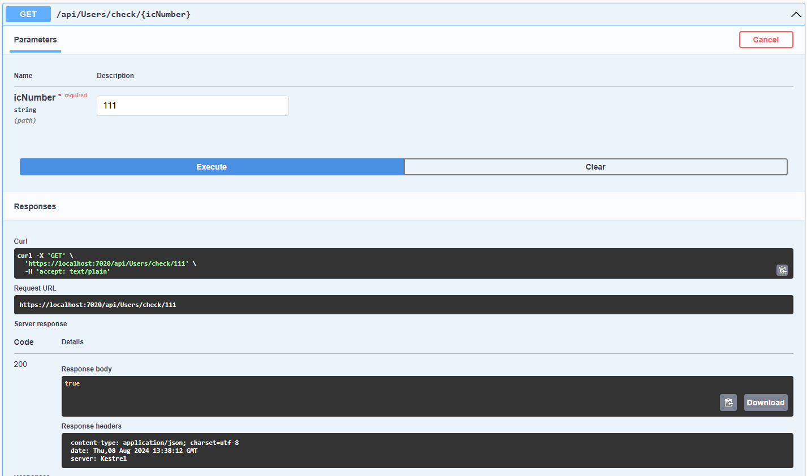
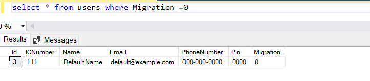

# Registration API's

## Checking IC Number 

Using this API we will be checking the IC number if it is migrated or not if it is not migrated then migration will be updated and the user will be migrated. After the migration the code will be send to the email and number which will be tested using the verify API.

## Checking IC Number 

